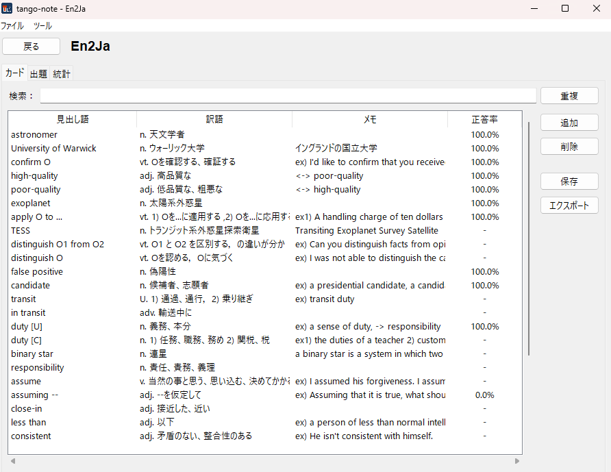
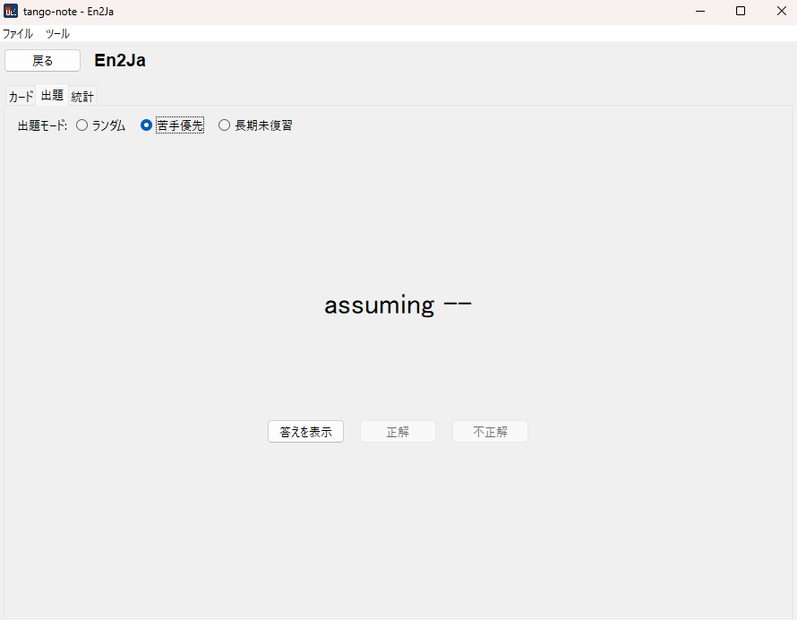
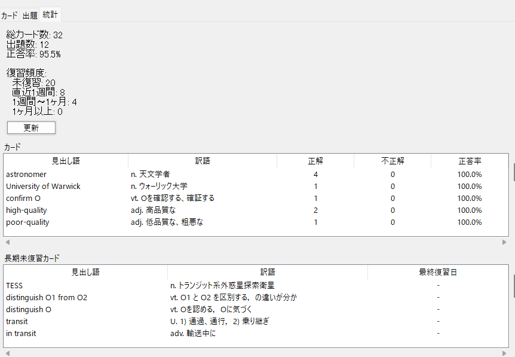

# Tango Note

ローカルファイルで管理する単語帳アプリ。CLI と Tkinter GUI の両方から同じコアロジックを呼べる。

## 目次

1. [目次](#目次)
2. [機能概要](#機能概要)
3. [ダウンロード / Download](#ダウンロード--download)
4. [クイックスタート / Quick Start](#クイックスタート--quick-start)
5. [必要環境](#必要環境)
6. [インストール (エンドユーザー向け)](#インストール-エンドユーザー向け)
7. [インストール (開発者向け)](#インストール-開発者向け)
   1. [開発用 (テスト・型ヒント・編集をすぐ反映)](#開発用-テスト型ヒント編集をすぐ反映)
   2. [通常インストール](#通常インストール)
8. [使い方 (CLI)](#使い方-cli)
   1. [一連の流れ](#一連の流れ)
   2. [サブコマンド](#サブコマンド)
   3. [`--deck` と `TANGO_NOTE_HOME`](#--deck-と-tango_note_home)
9. [使い方 (GUI)](#使い方-gui)
10. [ファイル配置](#ファイル配置)
11. [データモデル](#データモデル)
12. [国際化 (i18n)](#国際化-i18n)
13. [開発者向け](#開発者向け)
    1. [ディレクトリ構造](#ディレクトリ構造)
    2. [テスト](#テスト)
    3. [CLI の例外と exit code](#cli-の例外と-exit-code)
    4. [`.po` 編集後の `.mo` 再生成](#po-編集後の-mo-再生成)
14. [インストーラのビルド (配布側向け)](#インストーラのビルド-配布側向け)
15. [ロゴの差し替え](#ロゴの差し替え)
16. [スクリーンショット](#スクリーンショット)
17. [ライセンス](#ライセンス)
18. [著者](#著者)

## 機能概要

- ローカル JSON ファイルで管理する単語帳。1 デッキ = 1 ファイル。
- CLI (`tango-note` / `tn`) と GUI (`tango-note-gui` / `tn-gui`) の両方を提供し、同一の `core` ロジックを共有。
- UTF-8 で表現できる任意の言語に対応 (英・仏・中・日・キリル文字など)。
- ランダム出題と正誤統計の自動記録 (`stats.correct` / `stats.wrong` / `last_reviewed`)。
- gettext ベースの国際化 (現状は日本語 `ja` のみ提供、他言語は `.po` を足すだけで追加可能)。

## ダウンロード / Download

- [Releases](https://github.com/eyemask57/tango-note/releases) ページから最新の `tango-note-setup.exe` をダウンロードします。
- ダブルクリックするとウィザードが起動し、インストールが完了します (Python のインストールは不要)。

Download the latest `tango-note-setup.exe` from the
[Releases](https://github.com/eyemask57/tango-note/releases) page and
double-click it to install. No Python installation is required.

## クイックスタート / Quick Start

1. インストール後、スタートメニューから「Tango Note」を起動する。
2. メイン画面で「新規」をクリックしてデッキを作成する。
3. カードを追加して学習を開始する。

## 必要環境

- Python 3.10 以上
- OS: Windows 10/11, macOS, Linux のいずれか
- GUI を使う場合は標準ライブラリの `tkinter` が必要。Linux では `python3-tk` パッケージのインストールが別途必要なことがある。

## インストール (エンドユーザー向け)

Windows 用のインストーラ (`tango-note-setup.exe`) を受け取った場合、Python は不要です。

1. `tango-note-setup.exe` をダブルクリックする。
2. **Windows Defender SmartScreen** の警告が出ることがあります。これは未署名アプリに対する標準的な警告です。配布元を信頼できる場合は「詳細情報」→「実行」で続行してください。
3. ウィザードに従ってインストールする (ユーザー権限のみで完了でき、管理者権限は不要です)。
4. スタートメニューの「Tango Note」から起動する。

**アンインストール**: Windows の「設定 → アプリ」または「コントロール パネル → プログラムのアンインストール」から「Tango Note」を削除してください。

**ユーザーデータ**: 単語帳と設定は `~/.tango-note/` (`%USERPROFILE%\.tango-note\`) に保存されます。**アンインストールしてもこのフォルダは削除されません**（誤削除防止のため）。完全に消したい場合は手動で削除してください。

## インストール (開発者向け)

リポジトリを clone してから:

```
$ git clone <repo-url> tango-note
$ cd tango-note
```

### 開発用 (テスト・型ヒント・編集をすぐ反映)

```
$ pip install -e ".[dev]"
```

### 通常インストール

```
$ pip install .
```

> 現時点では PyPI 未公開。インストール元はローカルの clone のみ。

インストールが完了すると、以下の 4 つのコンソールスクリプトが使えるようになる。

| コマンド | 役割 |
|---|---|
| `tango-note`, `tn` | CLI 本体 |
| `tango-note-gui`, `tn-gui` | Tkinter GUI |

## 使い方 (CLI)

### 一連の流れ

``` cl

$ tango-note init "French Basics" --source-lang fr --target-lang ja
デッキを作成しました: French Basics
カレントデッキ: ~/.tango-note/decks/<uuid>.json

$ tango-note add bonjour こんにちは --notes "朝〜昼の挨拶"
カードを追加しました．

$ tango-note add merci ありがとう
カードを追加しました．

$ tango-note list
bonjour  ->  こんにちは  (朝〜昼の挨拶)
merci  ->  ありがとう

$ tango-note quiz
bonjour
[Enter で答えを表示, q で中断]
こんにちは
正解でしたか? [y/n/q]: y
正解！
...

$ tango-note stats
総カード数: 2
出題数: 1
正答率: 100.0%
```

短縮形 `tn` でも同じことができる:

```
$ tn list
$ tn quiz
```

### サブコマンド

| サブコマンド | 説明 |
|---|---|
| `init NAME [--source-lang LANG] [--target-lang LANG] [--path PATH]` | 新規デッキを作成し、カレントデッキに設定する。`--path` 省略時は `~/.tango-note/decks/<uuid>.json`。 |
| `add TERM DEFINITION [--notes NOTES] [--deck PATH]` | デッキにカードを追加する。 |
| `list [--deck PATH]` | デッキ内のカードを一覧表示する。 |
| `list-decks` | `~/.tango-note/decks/` 配下と現在の `current_deck` を一覧表示。先頭の `*` がカレント。 |
| `use PATH` | 指定パスのデッキをカレントに切り替える (config に書き込む)。 |
| `quiz [--deck PATH]` | 対話的出題。`Enter` で答え表示、`y`/`n`/`q` で評価。`q` または `Ctrl-C` で中断 (中断時もそれまでの統計は保存)。 |
| `stats [--deck PATH]` | デッキ全体の統計を表示する。 |
| `export DEST [--deck PATH]` | デッキを別ファイルへ書き出す。 |
| `import SOURCE [--force]` | デッキを取り込む。既存ファイルに衝突した場合は `--force` で上書き。 |

各コマンドの詳細は `tango-note <subcommand> --help` で確認できる。

### `--deck` と `TANGO_NOTE_HOME`

- `--deck PATH` (`-d PATH`) — 任意のデッキファイルを明示指定。指定がなければ config の `current_deck` を使う。どちらも未設定なら親切なエラーメッセージで終了する (exit code 1)。
- `TANGO_NOTE_HOME` 環境変数 — `~/.tango-note/` の代わりに使うディレクトリを指定。テスト時や複数プロファイル運用に便利。

```
$ TANGO_NOTE_HOME=/tmp/work tango-note init "Sandbox deck"
$ TANGO_NOTE_HOME=/tmp/work tango-note list
```

## 使い方 (GUI)

```
$ tango-note-gui
```

または短縮形:

```
$ tn-gui
```

画面構成:

1. **デッキ一覧** (起動直後の画面) — 既存デッキの一覧から選ぶか、`New deck` / `Import` で追加する。
2. **デッキ詳細** — タブで切り替わる 3 画面:
   - **Cards** — Treeview でカードを一覧。`Add card` / `Delete card` / 行のダブルクリックで編集、`Save` で永続化。
   - **Quiz** — `Show answer` で訳語を出し、`Correct` / `Wrong` で評価。評価ごとに自動保存。
   - **Stats** — `deck_summary` の数値とカード別の正答率テーブルを表示。

未保存の編集があるまま `Back` ボタンやウィンドウ ✕ を押すと、保存するかどうかの確認ダイアログが出る。

## ファイル配置

| パス | 役割 |
|---|---|
| `~/.tango-note/config.json` | アプリ設定 (UI 言語 `lang`、カレントデッキ `current_deck`)。 |
| `~/.tango-note/decks/<uuid>.json` | デフォルトのデッキ保存先。1 ファイル 1 デッキ。 |

`TANGO_NOTE_HOME` 環境変数を設定すると、上記の起点を `~/.tango-note/` から任意のディレクトリへ変更できる:

```
$ export TANGO_NOTE_HOME=/home/alice/projects/lang/data
$ tango-note init "..."   # この呼び出しでは /home/alice/projects/lang/data/decks/ に保存される
```

テスト・複数学習用途・USB メモリでの持ち運びなどに使える。

## データモデル

デッキファイルは UTF-8 の JSON。以下は最小構成の例:

```json
{
  "version": "1.0",
  "deck": {
    "id": "uuid-xxxx",
    "name": "French Basics",
    "source_lang": "fr",
    "target_lang": "ja",
    "created_at": "2026-05-12T10:00:00Z"
  },
  "cards": [
    {
      "id": "card-001",
      "term": "bonjour",
      "definition": "こんにちは",
      "notes": "朝〜昼の挨拶",
      "stats": {
        "correct": 3,
        "wrong": 1,
        "last_reviewed": "2026-05-10T08:00:00Z"
      }
    }
  ]
}
```

要点:

- `version` — スキーマバージョン。現状サポートしているのは `"1.0"` のみ。メジャー番号が異なるデッキは `InvalidDeckSchemaError` で拒否、マイナー番号違いは警告ログを出して読み込みを続ける。
- 言語コードは ISO 639-1 (`"fr"`, `"ja"`, `"zh"`, `"en"` …)。
- 日時は ISO 8601 / UTC (`Z` サフィックス推奨)。`storage.py` が `datetime` ↔ ISO 文字列を変換する。
- 非 ASCII の term/definition/notes はそのまま UTF-8 で書き出される (`ensure_ascii=False`)。`\uXXXX` エスケープは使わない。

## 国際化 (i18n)

現時点で同梱している翻訳は **日本語 (`ja`) のみ**。

新しい言語 (例: 中国語 `zh`) を追加する手順:

1. `locales/ja/LC_MESSAGES/tango_note.po` をコピーして `locales/zh/LC_MESSAGES/tango_note.po` を作成する。
2. 各エントリの `msgstr` を翻訳する。
3. msgfmt で `.mo` を生成する:

   ```
   $ python tools/msgfmt.py locales/zh/LC_MESSAGES/tango_note.po
   ```

4. `~/.tango-note/config.json` (または `TANGO_NOTE_HOME/config.json`) の `"lang"` を `"zh"` に変更する。

`gettext` の慣例どおり、`.mo` が見つからない言語コードは fallback として元の英語 message id をそのまま返す。

## 開発者向け

### ディレクトリ構造

```
src/tango_note/
├── core/        # ロジック層 (cli/gui に依存しない)
│   ├── models.py      # Card / CardStats / DeckMeta / Deck
│   ├── storage.py     # JSON 読み書き、スキーマ検証
│   ├── quiz.py        # pick_next
│   ├── stats.py       # record_correct/wrong, deck_summary
│   ├── config.py      # AppConfig, load/save
│   ├── i18n.py        # setup_i18n
│   └── exceptions.py  # ドメイン例外
├── cli/         # Typer ベースの CLI
│   └── main.py
└── gui/         # Tkinter GUI
    ├── main.py        # mainloop 起点
    ├── app.py         # MainWindow + DeckDetailScreen
    ├── handlers.py    # core 呼び出しを集約したロジック層
    └── screens/       # 個別画面 (deck_list / card_edit / quiz / stats)
tests/
├── core/        # core 各モジュールに対応
├── cli/         # CliRunner ベースの統合テスト
└── gui/         # handlers の単体テスト + Tk smoke
tools/
└── msgfmt.py    # .po → .mo 変換 (CPython 由来、PSF License)
locales/
└── ja/LC_MESSAGES/
    ├── tango_note.po  # 翻訳ソース
    └── tango_note.mo  # gettext が実際に読むバイナリ
```

依存方向は厳密に **`cli/`, `gui/` → `core/`** の一方向。表示用文字列 (`_("...")` でラップされるもの) は `cli/` と `gui/` の中だけに書き、`core/` は構造化値か例外型を返す。`gui/handlers.py` は core 呼び出しを集約する薄いラッパーで、Tkinter ウィジェットには触れない。

### テスト

```
$ pytest                       # 全テスト
$ pytest -v                    # 詳細表示
$ pytest tests/core            # core のみ
$ pytest tests/cli             # CLI のみ
$ pytest -k "not gui"          # GUI を除外
$ SKIP_GUI_TESTS=1 pytest      # GUI smoke テストを skip
```

- GUI smoke (`tests/gui/test_smoke.py`) は `DISPLAY` が無い Linux 環境では自動的に skip される。
- `tests/conftest.py` が pytest 起動時に必要に応じて `.po` → `.mo` を再ビルドするので、翻訳を編集した直後でも pytest はそのまま通る。

### CLI の例外と exit code

| Exit code | 意味 | 主な該当例外 |
|---|---|---|
| 0 | 成功 | — |
| 1 | ユーザー入力エラー | `DeckNotFoundError`, `EmptyDeckError`, `CardNotFoundError`, `DuplicateCardError`, `--deck`/`current_deck` 未設定、import の衝突 |
| 2 | データエラー | `InvalidDeckSchemaError`, `InvalidConfigError` |
| 130 | `Ctrl-C` による中断 (quiz) | `KeyboardInterrupt` |

`core/` 内の例外はすべて `TangoNoteError` を基底とし、`cli/main.py` の `_handle_core_errors` デコレータで集約的に翻訳・終了コードへマップする。

### `.po` 編集後の `.mo` 再生成

`.po` を書き換えたら `.mo` を必ず再生成すること:

```
$ python tools/msgfmt.py locales/ja/LC_MESSAGES/tango_note.po
```

gettext が実際に読むのは `.mo` の方なので、`.po` だけ更新しても表示は変わらない。pytest 経由なら `tests/conftest.py` が自動で再ビルドするが、CLI/GUI を手元で動かして確認する場合は明示的にコマンドを叩く必要がある。

## インストーラのビルド (配布側向け)

Windows 用の `.exe` とインストーラを生成する手順。**Windows + Inno Setup 6** が必要です。

1. ビルド用の依存をインストール:

   ```
   $ pip install -e ".[build]"
   ```

2. [Inno Setup 6](https://jrsoftware.org/isdl.php) をインストール (既定の場所、または環境変数 `INNO_SETUP_ISCC` で `ISCC.exe` のパスを指定)。

3. 一括ビルドを実行:

   ```
   $ python tools/build_installer.py
   ```

   これは順に、アイコン生成 → `.mo` 再コンパイル → PyInstaller で `.exe` ビルド → Inno Setup でインストーラ生成、を行います。

**生成物** (どちらも `dist/` に出力、`.gitignore` 対象):

- `dist/tango-note.exe` — 単体実行ファイル (Python 不要)
- `dist/tango-note-setup.exe` — 配布用インストーラ

PyInstaller スペック ([tango-note.spec](tango-note.spec)) と Inno Setup スクリプト ([installer/installer.iss](installer/installer.iss)) はコミット対象です。`installer.iss` は日本語を含むため **UTF-8 BOM 付き**で保存されています。

## ロゴの差し替え

アプリのロゴは `installer/tango-note_source.png` (512×512 の PNG) として配置されています。差し替える手順:

1. 元データを Adobe Illustrator (またはお使いの編集ソフト) で編集する。
2. PNG として書き出し、`installer/tango-note_source.png` に上書きする（256×256 以上、推奨は 1024×1024 など高解像度）。
3. アイコン (`.ico`) を再生成する:

   ```
   $ python tools/gen_icon.py
   ```

**SVG ソースを同梱していない理由**: ロゴのタイポグラフィが Adobe Fonts に依存しており、他環境ではフォントを再現できないためです。ベクタ編集が必要な場合は、ロゴ作成者が保持する元データ (Illustrator ファイル) を使用してください。

## スクリーンショット


*メイン画面: デッキ一覧とカード一覧*


*出題画面: 苦手優先モードでの学習*


*統計画面: 復習頻度の分布と長期未復習カード*

## ライセンス

本プロジェクトのソースコードは **MIT License** で配布する。詳細は [LICENSE](LICENSE) を参照。

例外: `tools/msgfmt.py` は CPython の `Tools/i18n/msgfmt.py` を改変したもので、**Python Software Foundation License Version 2** に基づく。元の著作権は Python Software Foundation に帰属し、ファイル冒頭の出典コメントで明示している。

## 著者

eyemask57 (https://x.com/eyemask2433)
